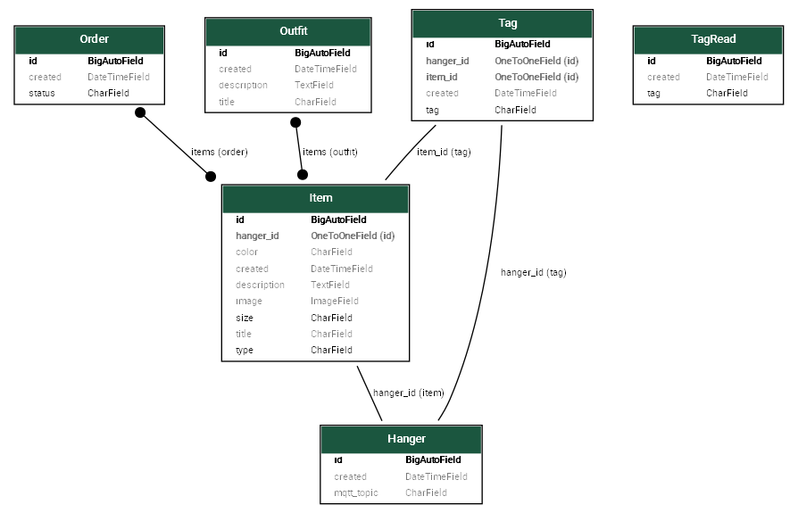

[](https://www.gnu.org/licenses/gpl-3.0)
[](https://codecov.io/github/Dressing-de-Laurianne/backend)


# Dressing API Project

This project is a Django REST API for managing a virtual wardrobe, built with Django, Django REST Framework and SQLite. It includes a Swagger UI for API exploration and is based on the official Django REST Framework tutorial.

## 🚀 Running with Docker

This project supports multiple Docker Compose configurations for different database backends (SQLite or PostgreSQL).
You will find the main Compose files:

- `docker-compose.prod.yml` (production with SQLite)
- `docker-compose.prod.postgresql.yml` (production with PostgreSQL)

Environment variables are managed through:

- `env.prod` for general project settings
- `env.db.sqlite` or `env.db.postgresql` for database-specific configuration, depending on the Compose file you use

When you start Docker, the container will automatically prepare the database and create an initial superuser with username `admin` and password `admin`.
You can change these credentials by editing the environment variables in `env.prod`.

To start the project in production mode with SQLite, use:

```bash
docker compose -f docker-compose.prod.yml up --build
```

To use PostgreSQL, run:

```bash
docker compose -f docker-compose.prod.postgresql.yml up --build
```

## 📚 Project Details

The project is organized into several Django apps:
- `item`: Manage clothing items
- `outfit`: Manage group of items
- `order`: Manage orders
- `hanger`, : Manage connected hander

### API Endpoints

The API exposes endpoints for managing items, orders, and more. Example endpoints:

- `/api/items/` — List and create clothing items
- `/api/orders/` — List and manage orders

> The API is based on the Django REST Framework tutorial: [DRF Serialization Tutorial](https://www.django-rest-framework.org/tutorial/1-serialization/)

### 🔎 API Documentation (Swagger UI)

Interactive API documentation is available at:

```
http://localhost:8000/api/schema/swagger-ui/
```

You can explore and test all endpoints directly from the browser.


## 🛠️ Development

### Using Docker

For development, use the dev compose file with SQLite. This setup mounts your local code directory into the container, so any changes you make are reflected immediately.
Unlike production, it does not run multiple threads or processes—only a single process is used, making debugging and development easier.

To start the development environment:

```bash
docker compose -f docker-compose.dev.yml up --build
```

### 🧹 Code Quality with pre-commit

To install and use pre-commit hooks for code quality checks:

```bash
pip install pre-commit
pre-commit install
pre-commit run --all-files
```

This will:
- Install pre-commit hooks
- Activate them for future commits
- Run all checks on your codebase

### 🧪 Running Tests

Before running tests, make sure your database is up to date:

```bash
pip install -r requirements.txt
python manage.py makemigrations
python manage.py migrate
```

To run all tests for the project:

```bash
pytest
```

To run a specific test:
```bash
pytest dressing/tests/test_hanger.py
```

Create reports, e.g in a "reports" folder, with the tests reports and codecoverage in XML and HTML:
```bash
pytest --junitxml=./reports/test_results.xml --cov=dressing --cov-report=xml:./reports/coverage.xml --cov-report=html:./reports/coverage_html/
```


> [!WARNING]
> If you encounter errors when running tests (especially on Windows), such as:
> ```
> django.core.exceptions.AppRegistryNotReady: Models aren't loaded yet.
> ```
>
> This can happen for example with `dressing/tests/test_tag_read`.
> You can run the tests inside Docker instead (note: this is slower):
>
> ```bash
> docker compose -f docker-compose.dev.yml run --remove-orphans dressing-api pytest
> ```

---

Feel free to contribute or adapt this project for your own needs!

---


### 🗺️ Database Schema Visualization with graph_models

To generate a visual graph of your Django models, we use the `django-extensions` package and the `graph_models` command.

#### Database Schema

Below is an example of the generated database schema (`db_schema.png`):

<p align="center">
</p>

#### Installation

Install Graphviz from [https://graphviz.org/download/](https://graphviz.org/download/).


#### Generate the Model Graph

Run the following command to generate a PNG image of your database schema:

```bash
python manage.py graph_models --pydot -o db_schema.png
```

See the [https://django-extensions.readthedocs.io/en/latest/graph_models.html](documentation) for details.
- `-a` includes all apps.

You can then open `db_schema.png` to view your database schema visually.


## TODO

- Check the environment to production mode (update settings, security, etc.).
- Check tests to each API endpoints.
- Adapt the front to use this new API version.
